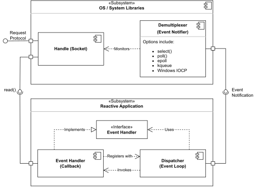
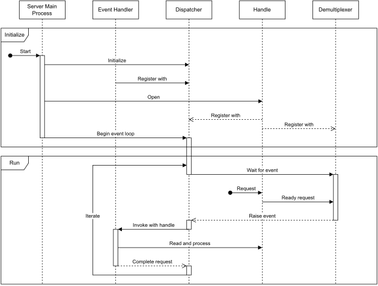

The reactor sofftware design pattern is an event handing strategy that can respond to many potential service requests concurrently.

The component is an event loop,runing in a single thread or process,which [demultiplexes](https://en.wikipedia.org/wiki/Demultiplex) incoming requests  and dispatches them to the correct request handler.[[1]](https://en.wikipedia.org/wiki/Reactor_pattern#cite_note-Schmidt_1995-1)

By relying on event-based mechanisms rather than [blocking I/O](https://en.wikipedia.org/wiki/Blocking_I/O "Blocking I/O") or multi-threading, a reactor can handle many concurrent [I/O bound](https://en.wikipedia.org/wiki/I/O_bound "I/O bound") requests with minimal delay.[[2]](https://en.wikipedia.org/wiki/Reactor_pattern#cite_note-Devresse_2014-2) A reactor also allows for easily modifying or expanding specific request handler routines, though the pattern does have some drawbacks and limitations.[[1]](https://en.wikipedia.org/wiki/Reactor_pattern#cite_note-Schmidt_1995-1)

With its balance of simplicity and [scalability](https://en.wikipedia.org/wiki/Scalability "Scalability"), the reactor has become a central architectural element in several [server](https://en.wikipedia.org/wiki/Server_(computing) "Server (computing)") applications and [software frameworks](https://en.wikipedia.org/wiki/Software_framework "Software framework") for [networking](https://en.wikipedia.org/wiki/Computer_network "Computer network"). Derivations such as the **multireactor** and [proactor](https://en.wikipedia.org/wiki/Proactor_pattern "Proactor pattern") also exist for special cases where even greater throughput, performance, or request complexity are necessary.[[1]](https://en.wikipedia.org/wiki/Reactor_pattern#cite_note-Schmidt_1995-1)[[2]](https://en.wikipedia.org/wiki/Reactor_pattern#cite_note-Devresse_2014-2)[[3]](https://en.wikipedia.org/wiki/Reactor_pattern#cite_note-Escoffier_2021-3)[[4]](https://en.wikipedia.org/wiki/Reactor_pattern#cite_note-Garrett_2015-4)

# Overview
Practical considerations for the [client–server model](https://en.wikipedia.org/wiki/Client%E2%80%93server_model "Client–server model") in large networks, such as the [C10k problem](https://en.wikipedia.org/wiki/C10k_problem "C10k problem") for [web servers](https://en.wikipedia.org/wiki/Web_server "Web server"), were the original motivation for the reactor pattern.[[5]](https://en.wikipedia.org/wiki/Reactor_pattern#cite_note-Kegel_2014-5)

A naive approach to handle service requests from many potential endpoints, such as [network sockets](https://en.wikipedia.org/wiki/Network_socket "Network socket") or [file descriptors](https://en.wikipedia.org/wiki/File_descriptor "File descriptor"), is to listen for new requests from within an event loop, then immediately [read](https://en.wikipedia.org/wiki/Read_(system_call) "Read (system call)") the earliest request. Once the entire request has been read, it can be processed and forwarded on by directly calling the appropriate handler. An entirely "iterative" server like this, which handles one request from start-to-finish per iteration of the event loop, is logically valid. However, it will fall behind once it receives multiple requests in quick succession. The iterative approach cannot scale because reading the request [blocks](https://en.wikipedia.org/wiki/Blocking_(computing) "Blocking (computing)") the server's only thread until the full request is received, and I/O operations are typically much slower than other computations.[[2]](https://en.wikipedia.org/wiki/Reactor_pattern#cite_note-Devresse_2014-2)

One strategy to overcome this limitation is multi-threading: by immediately splitting off each new request into its own worker thread, the first request will no longer block the event loop, which can immediately iterate and handle another request. This "thread per connection" design scales better than a purely iterative one, but it still contains multiple inefficiencies and will struggle past a point. From a standpoint of underlying [system resources](https://en.wikipedia.org/wiki/System_resource "System resource"), each new thread or process imposes [overhead](https://en.wikipedia.org/wiki/Overhead_(computing) "Overhead (computing)") costs in [memory](https://en.wikipedia.org/wiki/Computer_memory "Computer memory") and processing time (due to [context switching](https://en.wikipedia.org/wiki/Context_switch "Context switch")). The fundamental inefficiency of each thread waiting for I/O to finish isn't resolved either.[[1]](https://en.wikipedia.org/wiki/Reactor_pattern#cite_note-Schmidt_1995-1)[[2]](https://en.wikipedia.org/wiki/Reactor_pattern#cite_note-Devresse_2014-2)

From a design standpoint, both approaches [tightly couple](https://en.wikipedia.org/wiki/Tight_coupling "Tight coupling") the general demultiplexer with specific request handlers too, making the server code brittle and tedious to modify. These considerations suggest a few major design decisions:
1. Retain a single-threaded event handler; multi-threading introduces overhead and complexity without resolving the real issue of blocking I/O
2. Use an event notification mechanism to demultiplex requests only _after_ I/O is complete (so I/O is effectively non-blocking)
3. Register request handlers as [callbacks](https://en.wikipedia.org/wiki/Callback_(computer_programming) "Callback (computer programming)") with the event handler for better [separation of concerns](https://en.wikipedia.org/wiki/Separation_of_concern)

# Usage
The reactor pattern can be a good starting point for any concurrent, event-handling problem. The pattern is not restricted to network sockets either; hardware I/O, [file system](https://en.wikipedia.org/wiki/File_system "File system") or [database](https://en.wikipedia.org/wiki/Database "Database") access, [inter-process communication](https://en.wikipedia.org/wiki/Inter-process_communication "Inter-process communication"), and even abstract [message passing](https://en.wikipedia.org/wiki/Message_passing "Message passing") systems are all possible use-cases.[_[citation needed](https://en.wikipedia.org/wiki/Wikipedia:Citation_needed "Wikipedia:Citation needed")_]

However, the reactor pattern does have limitations, a major one being the use of callbacks, which make [program analysis](https://en.wikipedia.org/wiki/Program_analysis "Program analysis") and [debugging](https://en.wikipedia.org/wiki/Debugging "Debugging") more difficult, a problem common to designs with [inverted control](https://en.wikipedia.org/wiki/Inversion_of_control "Inversion of control").[[1]](https://en.wikipedia.org/wiki/Reactor_pattern#cite_note-Schmidt_1995-1) The simpler thread-per-connection and fully iterative approaches avoid this and can be valid solutions if scalability or high-throughput are not required.[[a]](https://en.wikipedia.org/wiki/Reactor_pattern#cite_note-6)[_[citation needed](https://en.wikipedia.org/wiki/Wikipedia:Citation_needed "Wikipedia:Citation needed")_]

Single-threading can also become a drawback in use-cases that require maximum throughput, or when requests involve significant processing. Different multi-threaded designs can overcome these limitations, and in fact, some still use the reactor pattern as a sub-component for handling events and I/O.[[1]](https://en.wikipedia.org/wiki/Reactor_pattern#cite_note-Schmidt_1995-1)

# Applications
The reactor pattern (or a variant of it) has found a place in many web servers, [application servers](https://en.wikipedia.org/wiki/Application_server "Application server"), and networking frameworks:

- [Adaptive Communication Environment](https://en.wikipedia.org/wiki/Adaptive_Communication_Environment "Adaptive Communication Environment")[[1]](https://en.wikipedia.org/wiki/Reactor_pattern#cite_note-Schmidt_1995-1)
- [EventMachine](https://en.wikipedia.org/wiki/EventMachine "EventMachine")[_[citation needed](https://en.wikipedia.org/wiki/Wikipedia:Citation_needed "Wikipedia:Citation needed")_]
- [Netty](https://en.wikipedia.org/wiki/Netty_(software) "Netty (software)")[[3]](https://en.wikipedia.org/wiki/Reactor_pattern#cite_note-Escoffier_2021-3)
- [Nginx](https://en.wikipedia.org/wiki/Nginx "Nginx")[[4]](https://en.wikipedia.org/wiki/Reactor_pattern#cite_note-Garrett_2015-4)
- [Node.js](https://en.wikipedia.org/wiki/Node.js "Node.js")[[2]](https://en.wikipedia.org/wiki/Reactor_pattern#cite_note-Devresse_2014-2)[[6]](https://en.wikipedia.org/wiki/Reactor_pattern#cite_note-Bon%C3%A9r_2022-7)
- [Perl Object Environment](https://en.wikipedia.org/wiki/Perl_Object_Environment "Perl Object Environment")[_[citation needed](https://en.wikipedia.org/wiki/Wikipedia:Citation_needed "Wikipedia:Citation needed")_]
- [POCO C++ Libraries](https://en.wikipedia.org/wiki/POCO_C%2B%2B_Libraries "POCO C++ Libraries")[[7]](https://en.wikipedia.org/wiki/Reactor_pattern#cite_note-POCO_Network_Programming-8)
- [Spring Framework](https://en.wikipedia.org/wiki/Spring_Framework "Spring Framework") (version 5 and later)[[8]](https://en.wikipedia.org/wiki/Reactor_pattern#cite_note-Stoyanchev_2016-9)
- [Twisted](https://en.wikipedia.org/wiki/Twisted_(software) "Twisted (software)")[[9]](https://en.wikipedia.org/wiki/Reactor_pattern#cite_note-Twisted_2024-10)
- [Vert.x](https://en.wikipedia.org/wiki/Vert.x "Vert.x")[[3]](https://en.wikipedia.org/wiki/Reactor_pattern#cite_note-Escoffier_2021-3)
# structure 
UML 2 component diagram of a reactive application.[[1](https://en.wikipedia.org/wiki/Reactor_pattern#cite_note-Schmidt_1995-1)

UML 2 sequence diagram of a reactive server.[[1]](https://en.wikipedia.org/wiki/Reactor_pattern#cite_note-Schmidt_1995-1)

A reactive application consists of several moving parts and will rely on some support mechanisms:[[1]](https://en.wikipedia.org/wiki/Reactor_pattern#cite_note-Schmidt_1995-1)

### Handle

An identifier and interface to a specific request, with IO and data. This will often take the form of a socket, file descriptor, or similar mechanism, which should be provided by most modern operating systems.

### Demultiplexer

An event notifier that can efficiently monitor the _status_ of a handle, then notify other subsystems of a relevant status change (typically an IO handle becoming "ready to read"). Traditionally this role was filled by the [select() system call](https://en.wikipedia.org/wiki/Select_(Unix) "Select (Unix)"), but more contemporary examples include [epoll](https://en.wikipedia.org/wiki/Epoll "Epoll"), [kqueue](https://en.wikipedia.org/wiki/Kqueue "Kqueue"), and [IOCP](https://en.wikipedia.org/wiki/IOCP "IOCP").

### Dispatcher

The actual event loop of the reactive application, this component maintains the registry of valid event handlers, then invokes the appropriate handler when an event is raised.

### Event Handler

Also known as a request handler, this is the specific logic for processing one type of service request. The reactor pattern suggests registering these dynamically with the dispatcher as callbacks for greater flexibility. By default, a reactor does _not_ use multi-threading but invokes a request handler within the same thread as the dispatcher.

### Event Handler Interface

An abstract interface class, representing the general properties and methods of an event handler. Each specific handler must implement this interface while the dispatcher will operate on the event handlers through this interface.

[C10k problem - Wikipedia](https://en.wikipedia.org/wiki/C10k_problem)

# Simple
## class Reactor
~~~c
/**

 * \brief Reactor.

 *

 * An implementation of the reactor design pattern.

 */

class Reactor {

 public:

  /**

   * \brief Constructor of Reactor.

   */

  Reactor();

  /**

   * \brief Destructor of Reactor.

   */

  ~Reactor();

  /**

   * \brief Registers an event handler for a file descriptor.

   *

   * \param handle A file descriptor.

   * \param event_handler A pointer to an event handler.

   * \param event_type_mask A mask of event types for which the passed event handler should be registered.

   * \param one_shot Specifies if the event handler should be automatically unregistered after the first event

   * occurrence.

   */

  void register_event_handler(int handle, EventHandler* event_handler, unsigned int event_type_mask,

                              bool one_shot = false);

  /**

   * \brief Unregisters a previously registered event handler for a file descriptor.

   *

   * \param handle A file descriptor.

   * \param event_type_mask A mask of event types for which the event handler should be unregistered.

   */

  void unregister_event_handler(int handle, unsigned int event_type_mask);

  /**

   * \brief Lets the reactor check whether some events are pending on any registered file descriptors and dispatch

   *        the corresponding event handlers.

   *

   * \param timeout A pointer to a time value to wait for events. In case of the null pointer the reactor

   *                will not block waiting for events.

   */

  void handle_events(const struct timeval* timeout = nullptr);

  /**

   * \brief Causes the reactor to return from the blocking call of the function handle_events.

   */

  void unblock();

  

 private:

  /* Log context */

  const std::string log = "Reactor";

  /**

   * \brief Structure for storing registered event handlers.

   */

  struct EventHandlerMapEntry {

    EventHandler* event_handler_;

    bool one_shot_;

  };

  /**

   * \brief Notifies registered event handlers for which events are available.

   */

  void dispatch_event_handlers();

  /**

   * \brief Sets up file descriptor sets required for the select system call.

   */

  int setup_fd_sets();

  /**

   * \brief Sends wakeup signal to unblocks the select system call being executed in the function handle_events.

   */

  void send_wakeup();

  /**

   * \brief Handles wakeup signal sent by the function send_wakeup.

   */

  void handle_wakeup();

  /**

   * \brief Pipe used for unblocking a blocked select call.

   */

  std::array<int, 2> wakeup_pipe_;

  /**

   * \brief Indicates whether the reactor is currently dispatching occurred events.

   */

  std::atomic_bool dispatching_;

  /**

   * \brief File descriptor sets required for the select system call.

   */

  fd_set rfds, wfds, efds;

  /**

   * \brief Event handlers for read events.

   */

  std::map<int, EventHandlerMapEntry> read_event_handlers_;

  /**

   * \brief Event handlers for write events.

   */

  std::map<int, EventHandlerMapEntry> write_event_handlers_;

  /**

   * \brief Event handlers for exception events.

   */

  std::map<int, EventHandlerMapEntry> exception_event_handlers_;

};
~~~

## event_handler
~~~c
  

/**

 * \brief Reactor event handler.

 */

class EventHandler {

 public:

  /**

   * \brief Destructor of EventHandler.

   */

  virtual ~EventHandler() = default;

  

  /**

   * \brief Read event handler.

   *

   * \param handle A file descriptor.

   *

   * This function is called by reactor whenever the file descriptor becomes readable.

   */

  virtual void handle_read(int handle) {}

  

  /**

   * \brief Write event handler.

   *

   * \param handle A file descriptor.

   *

   * This function is called by reactor whenever the file descriptor becomes writable.

   */

  virtual void handle_write(int handle) {}

  

    /**

   * \brief Exception event handler.

   *

   * \param handle A file descriptor.

   *

   * This function is called by reactor whenever an exception condition occurs on the file descriptor.

   */

  virtual void handle_exception(int handle) {}

};

  

} /* namespace reactor */
~~~

## func
~~~c
  

Reactor::Reactor() : dispatching_(false) {

  /* Create a pipe for unblocking the select system call */

  int ret = pipe(wakeup_pipe_.data());

  if (ret != 0) {

    std::runtime_error("pipe");

  }

}

  

Reactor::~Reactor() {

  unblock();

  // TODO: Verify that no method of Reactor is still running when the object is destroyed.

  ::close(wakeup_pipe_[0]);

  ::close(wakeup_pipe_[1]);

}

  

void Reactor::register_event_handler(int handle, EventHandler* event_handler, unsigned int event_type_mask,

                                     bool one_shot) {

  if (event_type_mask & EventType::kReadEvent) {

    read_event_handlers_.insert(std::pair<int, EventHandlerMapEntry>(handle, {event_handler, one_shot}));

  }

  if (event_type_mask & EventType::kWriteEvent) {

    write_event_handlers_.insert(std::pair<int, EventHandlerMapEntry>(handle, {event_handler, one_shot}));

  }

  if (event_type_mask & EventType::kExceptionEvent) {

    exception_event_handlers_.insert(std::pair<int, EventHandlerMapEntry>(handle, {event_handler, one_shot}));

  }

  if (!dispatching_) {

    send_wakeup();

  }

}

  

void Reactor::unregister_event_handler(int handle, unsigned int event_type_mask) {

  size_t count = 0;

  if (event_type_mask & EventType::kReadEvent) {

    count += read_event_handlers_.erase(handle);

  }

  if (event_type_mask & EventType::kWriteEvent) {

    count += write_event_handlers_.erase(handle);

  }

  if (event_type_mask & EventType::kExceptionEvent) {

    count += exception_event_handlers_.erase(handle);

  }

  if (count > 0 && !dispatching_) {

    send_wakeup();

  }

}

  

void Reactor::handle_events(const struct timeval* timeout) {

  struct timeval tv;

  struct timeval* tv_ptr = nullptr;

  if (timeout != nullptr) {

    // select() on Linux modifies the object under tv_ptr, therefore we copy the passed data.

    tv = *timeout;

    tv_ptr = &tv;

  }

  

  int maxfd = setup_fd_sets();

  

  int count = select(maxfd + 1, &rfds, &wfds, &efds, tv_ptr);

  if (count > 0) {

    dispatch_event_handlers();

  }

}

  

void Reactor::unblock() { send_wakeup(); }

  

int Reactor::setup_fd_sets() {

  FD_ZERO(&rfds);

  FD_ZERO(&wfds);

  FD_ZERO(&efds);

  

  FD_SET(wakeup_pipe_[0], &rfds);

  int maxfd = wakeup_pipe_[0];

  

  for (const auto& p : read_event_handlers_) {

    FD_SET(p.first, &rfds);

    maxfd = std::max(maxfd, p.first);

  }

  

  for (const auto& p : write_event_handlers_) {

    FD_SET(p.first, &wfds);

    maxfd = std::max(maxfd, p.first);

  }

  

  for (const auto& p : exception_event_handlers_) {

    FD_SET(p.first, &efds);

    maxfd = std::max(maxfd, p.first);

  }

  

  return maxfd;

}

  

void Reactor::dispatch_event_handlers() {

  dispatching_ = true;

  

  if (FD_ISSET(wakeup_pipe_[0], &rfds)) {

    handle_wakeup();

  }

  

  for (auto it = read_event_handlers_.begin(); it != read_event_handlers_.end();) {

    int handle = it->first;

    auto entry = it->second;

    if (FD_ISSET(handle, &rfds)) {

      std::cout << log << ": " << "Dispatching read event" << std::endl;

      if (entry.one_shot_) {

        it = read_event_handlers_.erase(it);

      } else {

        ++it;

      }

      entry.event_handler_->handle_read(handle);

    } else {

      ++it;

    }

  }

  

  for (auto it = write_event_handlers_.begin(); it != write_event_handlers_.end();) {

    int handle = it->first;

    auto entry = it->second;

    if (FD_ISSET(handle, &wfds)) {

      std::cout << log << ": " << "Dispatching write event" << std::endl;

      if (entry.one_shot_) {

        it = write_event_handlers_.erase(it);

      } else {

        ++it;

      }

      entry.event_handler_->handle_write(handle);

    } else {

      ++it;

    }

  }

  

  for (auto it = exception_event_handlers_.begin(); it != exception_event_handlers_.end();) {

    int handle = it->first;

    auto entry = it->second;

    if (FD_ISSET(handle, &efds)) {

      std::cout << log << ": " << "Dispatching exception event" << std::endl;

      if (entry.one_shot_) {

        it = exception_event_handlers_.erase(it);

      } else {

        ++it;

      }

      entry.event_handler_->handle_exception(handle);

    } else {

      ++it;

    }

  }

  

  dispatching_ = false;

}

  

void Reactor::send_wakeup() {

  int ret;

  char dummy;

  

  ret = ::write(wakeup_pipe_[1], &dummy, sizeof(dummy));

  if (ret != sizeof(dummy)) {

    std::runtime_error("write");

  }

}

  

void Reactor::handle_wakeup() {

  int ret;

  char dummy;

  

  ret = ::read(wakeup_pipe_[0], &dummy, sizeof(dummy));

  if (ret != sizeof(dummy)) {

    std::runtime_error("read");

  }

}
  

Reactor::Reactor() : dispatching_(false) {

  /* Create a pipe for unblocking the select system call */

  int ret = pipe(wakeup_pipe_.data());

  if (ret != 0) {

    std::runtime_error("pipe");

  }

}

  

Reactor::~Reactor() {

  unblock();

  // TODO: Verify that no method of Reactor is still running when the object is destroyed.

  ::close(wakeup_pipe_[0]);

  ::close(wakeup_pipe_[1]);

}

  

void Reactor::register_event_handler(int handle, EventHandler* event_handler, unsigned int event_type_mask,

                                     bool one_shot) {

  if (event_type_mask & EventType::kReadEvent) {

    read_event_handlers_.insert(std::pair<int, EventHandlerMapEntry>(handle, {event_handler, one_shot}));

  }

  if (event_type_mask & EventType::kWriteEvent) {

    write_event_handlers_.insert(std::pair<int, EventHandlerMapEntry>(handle, {event_handler, one_shot}));

  }

  if (event_type_mask & EventType::kExceptionEvent) {

    exception_event_handlers_.insert(std::pair<int, EventHandlerMapEntry>(handle, {event_handler, one_shot}));

  }

  if (!dispatching_) {

    send_wakeup();

  }

}

  

void Reactor::unregister_event_handler(int handle, unsigned int event_type_mask) {

  size_t count = 0;

  if (event_type_mask & EventType::kReadEvent) {

    count += read_event_handlers_.erase(handle);

  }

  if (event_type_mask & EventType::kWriteEvent) {

    count += write_event_handlers_.erase(handle);

  }

  if (event_type_mask & EventType::kExceptionEvent) {

    count += exception_event_handlers_.erase(handle);

  }

  if (count > 0 && !dispatching_) {

    send_wakeup();

  }

}

  

void Reactor::handle_events(const struct timeval* timeout) {

  struct timeval tv;

  struct timeval* tv_ptr = nullptr;

  if (timeout != nullptr) {

    // select() on Linux modifies the object under tv_ptr, therefore we copy the passed data.

    tv = *timeout;

    tv_ptr = &tv;

  }

  

  int maxfd = setup_fd_sets();

  

  int count = select(maxfd + 1, &rfds, &wfds, &efds, tv_ptr);

  if (count > 0) {

    dispatch_event_handlers();

  }

}

  

void Reactor::unblock() { send_wakeup(); }

  

int Reactor::setup_fd_sets() {

  FD_ZERO(&rfds);

  FD_ZERO(&wfds);

  FD_ZERO(&efds);

  

  FD_SET(wakeup_pipe_[0], &rfds);

  int maxfd = wakeup_pipe_[0];

  

  for (const auto& p : read_event_handlers_) {

    FD_SET(p.first, &rfds);

    maxfd = std::max(maxfd, p.first);

  }

  

  for (const auto& p : write_event_handlers_) {

    FD_SET(p.first, &wfds);

    maxfd = std::max(maxfd, p.first);

  }

  

  for (const auto& p : exception_event_handlers_) {

    FD_SET(p.first, &efds);

    maxfd = std::max(maxfd, p.first);

  }

  

  return maxfd;

}

  

void Reactor::dispatch_event_handlers() {

  dispatching_ = true;

  

  if (FD_ISSET(wakeup_pipe_[0], &rfds)) {

    handle_wakeup();

  }

  

  for (auto it = read_event_handlers_.begin(); it != read_event_handlers_.end();) {

    int handle = it->first;

    auto entry = it->second;

    if (FD_ISSET(handle, &rfds)) {

      std::cout << log << ": " << "Dispatching read event" << std::endl;

      if (entry.one_shot_) {

        it = read_event_handlers_.erase(it);

      } else {

        ++it;

      }

      entry.event_handler_->handle_read(handle);

    } else {

      ++it;

    }

  }

  

  for (auto it = write_event_handlers_.begin(); it != write_event_handlers_.end();) {

    int handle = it->first;

    auto entry = it->second;

    if (FD_ISSET(handle, &wfds)) {

      std::cout << log << ": " << "Dispatching write event" << std::endl;

      if (entry.one_shot_) {

        it = write_event_handlers_.erase(it);

      } else {

        ++it;

      }

      entry.event_handler_->handle_write(handle);

    } else {

      ++it;

    }

  }

  

  for (auto it = exception_event_handlers_.begin(); it != exception_event_handlers_.end();) {

    int handle = it->first;

    auto entry = it->second;

    if (FD_ISSET(handle, &efds)) {

      std::cout << log << ": " << "Dispatching exception event" << std::endl;

      if (entry.one_shot_) {

        it = exception_event_handlers_.erase(it);

      } else {

        ++it;

      }

      entry.event_handler_->handle_exception(handle);

    } else {

      ++it;

    }

  }

  

  dispatching_ = false;

}

  

void Reactor::send_wakeup() {

  int ret;

  char dummy;

  

  ret = ::write(wakeup_pipe_[1], &dummy, sizeof(dummy));

  if (ret != sizeof(dummy)) {

    std::runtime_error("write");

  }

}

  

void Reactor::handle_wakeup() {

  int ret;

  char dummy;

  

  ret = ::read(wakeup_pipe_[0], &dummy, sizeof(dummy));

  if (ret != sizeof(dummy)) {

    std::runtime_error("read");

  }

}
~~~
